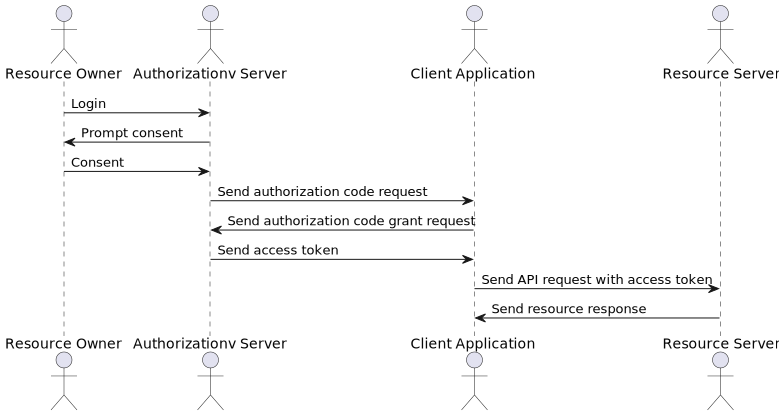
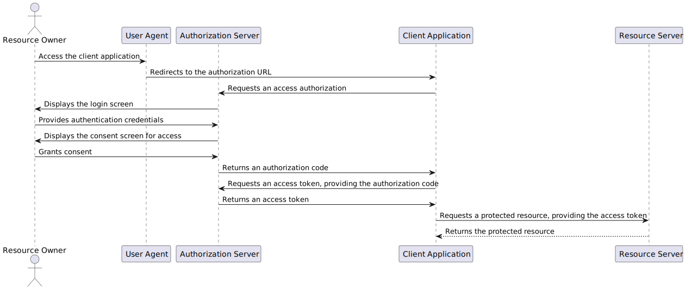
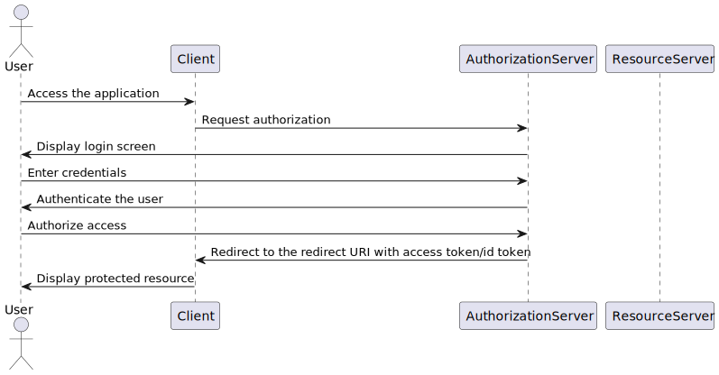
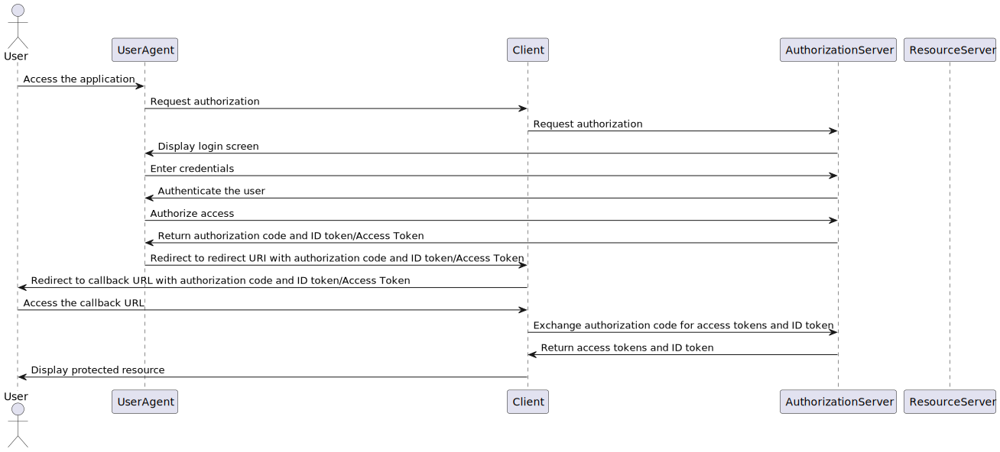
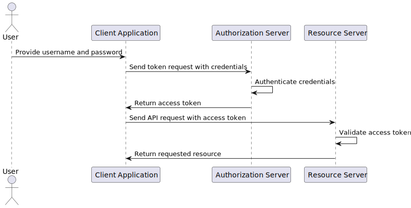

# Authentication with Keycloak 

Keycloak is an open-source identity and access management solution that supports both OAuth 2.0 and OpenID Connect protocols, providing a secure and centralized way to manage user identities, roles, and permissions across applications and services. Keycloak acts as an authorization server, handling user authentication, authorization, and token issuance, ensuring secure access to resources. It offers various features like user federation, social login, multi-factor authentication, and fine-grained access control, making it a popular choice for securing modern applications and microservices. Keycloak can be easily integrated with existing systems and applications, supporting various client types (e.g., web, mobile, service accounts) and deployment options (e.g., standalone, clustered, cloud).

It's important to mention that, even though Keycloak is a powerful and feature-rich solution, there are other alternatives available in the market, such as Auth0, Okta, and AWS Cognito, each with its own strengths and use cases. 

## OAuth 2.0

OAuth 2.0 is an industry-standard protocol for authorization that enables secure delegated access to resources without sharing user credentials. It works by allowing a resource owner (user) to grant a third-party application limited access to their resources on a server, using an access token instead of credentials like a username and password. The process involves four key roles: the **resource owner** (user), **resource server** (API), **client** (application requesting access), and **authorization server** (issues tokens). OAuth 2.0 uses different flows (e.g., authorization code, client credentials) to cater to various use cases, such as web, mobile, and server-to-server communication, ensuring flexibility and enhanced security. Companies like Google, Facebook, and GitHub use OAuth 2.0 in their APIs, for example.

Below is a simple sequence diagram illustrating the OAuth 2.0 flow:



## OpenID Connect

OpenID Connect (OIDC) is an identity layer built on top of the OAuth 2.0 protocol, designed to enable authentication and provide user identity information in a secure and standardized way. It allows clients (applications) to verify the identity of end-users based on the authentication performed by an authorization server and to obtain basic profile information via standardized claims. OIDC adds an **ID token**, a JSON Web Token (JWT), to OAuth 2.0 flows, which contains user information and is digitally signed for integrity. It is widely used for single sign-on (SSO) scenarios, ensuring seamless user authentication across multiple applications while maintaining security and simplicity.

## Main use cases for Keycloak

- **Single Sign-On (SSO)**: Keycloak provides a centralized authentication and authorization mechanism, enabling users to log in once and access multiple applications without re-entering credentials.

- **API Protection**: Keycloak can secure APIs by issuing access tokens and validating them against the authorization server, ensuring that only authorized clients can access protected resources.

- **User Federation**: Keycloak supports user federation, allowing organizations to integrate with external identity providers like LDAP, Active Directory, and social login services, simplifying user management and authentication.

- **Multi-Factor Authentication (MFA)**: Keycloak offers MFA capabilities, such as OTP (One-Time Password), email verification, and biometric authentication, enhancing security by requiring multiple factors for user authentication.

- **Fine-Grained Access Control**: Keycloak enables organizations to define and enforce fine-grained access policies based on user roles, permissions, and attributes, ensuring that users have the right level of access to resources.

## Realm

In Keycloak, a **realm** is a security administrative domain where users, applications, and resources are managed and secured. Realms are isolated from each other, allowing organizations to define separate security policies, user stores, and authentication flows for different environments or applications. Each realm has its own configuration settings, user database, roles, and client applications, providing a logical boundary for managing identities and access control. Keycloak supports multiple realms within a single instance, enabling organizations to create distinct security domains for different use cases or departments.

## Roles and Groups

Keycloak uses **roles** and **groups** to manage user permissions and access control within a realm. **Roles** define a set of permissions or privileges that can be assigned to users or client applications, allowing fine-grained control over resource access. Users can have multiple roles assigned to them, enabling organizations to implement role-based access control (RBAC) policies. **Groups**, on the other hand, are collections of users that can be used to organize users based on common attributes or roles. Groups simplify user management by allowing administrators to assign roles to multiple users at once and manage permissions at a group level.

## Clients

In Keycloak, a **client** represents an application or service that interacts with the Keycloak server to authenticate users and access protected resources. Clients can be of different types, such as web applications, mobile apps, service accounts, or APIs, each requiring specific configurations and authentication mechanisms. Keycloak supports various client protocols, including OpenID Connect, OAuth 2.0, and SAML, enabling seamless integration with different types of applications and services. Clients can request access tokens, refresh tokens, and ID tokens from the Keycloak server to authenticate users and authorize access to resources, ensuring secure communication and data protection.

## Authentication flows

Keycloak provides flexible **authentication flows** to authenticate users based on different criteria, such as username/password, social login, multi-factor authentication, and client certificates. Authentication flows define the sequence of authentication steps that users must complete to prove their identity and gain access to protected resources. Keycloak supports customizable authentication flows, allowing organizations to define custom authentication requirements, implement adaptive authentication policies, and integrate with external identity providers. By configuring authentication flows, organizations can enforce security policies, enhance user experience, and meet compliance requirements effectively.

### Authorization Code Flow 

The **authorization code flow** is one of the most common OAuth 2.0 flows used for web applications that require user authentication. It involves multiple steps, starting with the client redirecting the user to the Keycloak server for authentication. Once the user logs in and consents to the requested permissions, the server issues an authorization code to the client. The client then exchanges the authorization code for an access token and refresh token, which can be used to access protected resources on behalf of the user. The authorization code flow ensures secure communication between the client and the Keycloak server, preventing exposure of sensitive information like access tokens in the browser.



You can find a simplistic example implementation of this flow in the [authorization-code-flow](./authorization-code-flow) directory.

#### Known Possible Vulnerabilities

- **Replay Attacks**: An attacker can intercept the authorization code and replay it to obtain an access token, impersonating the legitimate user. To prevent replay attacks, it's essential to use secure communication channels, validate tokens, and implement anti-replay mechanisms.

- **Cross-Site Request Forgery (CSRF)**: An attacker can trick a user into executing unauthorized actions on the client application by exploiting CSRF vulnerabilities. To mitigate CSRF attacks, developers should implement CSRF protection mechanisms like CSRF tokens and same-site cookies.

### Implicit Flow

The Implicit Flow is an OAuth 2.0 authorization mechanism designed for scenarios where the client (application) cannot securely store credentials, such as single-page applications (SPAs) and mobile applications. It allows the application to obtain an access token directly from the authorization server without the need for an intermediate authorization code exchange. This flow is particularly suitable for front-end JavaScript applications, as the access token is delivered directly in the user's browser immediately after the application makes an authorization request.

Despite its simplicity and efficiency, the Implicit Flow has significant security limitations. The direct delivery of the access token in the user's browser exposes it to risks such as cross-site scripting (XSS) attacks if proper security measures are not in place. Furthermore, the Implicit Flow does not provide a refresh token, requiring the application to redirect users to the authorization server to obtain a new access token once the current one expires. While this flow is convenient for certain use cases, its use demands careful consideration of security precautions to protect access tokens. 



You can find a simplistic example implementation of this flow in the [implicit-flow](./implicit-flow) directory.

## Hybrid flow

The Hybrid Flow is an OAuth 2.0 authorization mechanism that combines elements of the **Authorization Code Flow** and the **Implicit Flow** to provide a more secure and flexible approach for web applications. It is mainly designed to address the limitations of the Implicit Flow, such as the lack of refresh tokens and the exposure of access tokens in the browser. The Hybrid Flow allows the client to receive an authorization code and an ID token directly from the authorization server, while the access token is obtained through a back-channel token exchange. This approach ensures that sensitive tokens are not exposed in the browser and provides additional security features like token validation and integrity checks.



you can find a simplistic example implementation of this flow in the [hybrid-flow](./authentication-flow/hybrid-flow) directory.

## Resource Owner Password Credentials Flow

The **Resource Owner Password Credentials (ROPC)** flow, also known as **Direct Grant** flow, is an OAuth 2.0 authorization method that allows a client to obtain an access token using the user’s credentials, such as a username and password, directly. This flow can be useful in scenarios where the client and authorization server are under full control, making implementation simpler for trusted applications. However, it comes with significant security risks, including the direct exposure of user credentials and lack of support for two-factor authentication, which can compromise overall security.

Unlike other OAuth flows like **Authorization Code** or **Implicit**, the ROPC flow does not support granular scopes, meaning the client requests access to all resources the user has permissions for, which may be excessive in certain cases. It is not designed to natively support **Single Sign-On (SSO)**, as it focuses on direct authentication rather than federated identity systems. For SSO, protocols like **OpenID Connect (OIDC)**, combined with OAuth 2.0 flows, are more suitable, as they provide secure and flexible authentication across multiple applications.

Given its limitations, the ROPC flow is generally not recommended unless specific conditions make it necessary. In most cases, using more secure and robust alternatives like the Authorization Code flow, which includes additional security measures and flexibility, is preferred. These approaches are better suited for modern authentication needs, including support for SSO and multi-factor authentication.



You can find a simplistic example implementation of this flow in the [direct-grant](./authentication-flow/direct-grant/) directory.

## Running Locally

To run the examples locally, you need to have Docker installed on your machine, and the `fullcycle` network created. 

- Create the `fullcycle` network:

```
docker network create fullcycle
```

- Run the Keycloak server:

```bash
cd keycloak && docker-compose up -d
```

- Run the example application container:

```bash
cd authorization-code-flow && docker-compose up -d
```

- Access the container:

```bash
docker compose exec app bash
```

- Run the example application you want:

```bash
npm run authorization-code # Authorization Code Flow
npm run implicit # Implicit Flow
npm run hybrid # Hybrid Flow
npm run direct-grant # Resource Owner Password Credentials Flow
```
